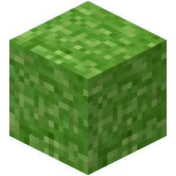

<p align="center">
  
</p>

<h1 align="center">VegOps Containers</h1>

<p align="center">
  <a href="https://github.com/vegops/containers/actions/workflows/build.yaml"></a>
  <a href="https://vegops.sh/containers/"></a>
  <a href="https://github.com/vegops/containers/blob/main/LICENSE"></a>
</p>

<p align="center">
  Hardened, distroless container images built with <a href="https://github.com/chainguard-dev/melange">melange</a> + <a href="https://github.com/chainguard-dev/apko">apko</a> on <a href="https://github.com/wolfi-dev">Wolfi</a>.
  <br>
  <a href="https://vegops.sh/containers/"><b>vegops.sh/containers</b></a> — live vulnerability reports, updated daily.
</p>

---

### Every image is:

- **Distroless** — no shell, no package manager at runtime.
- **Minimal CVEs** — rebuilt daily with the latest Wolfi security patches.
- **Signed** — with [cosign](https://github.com/sigstore/cosign) keyless signing.
- **SBOM included** — SPDX generated automatically by apko.
- **Multi-arch** — supporting both `x86_64` and `aarch64`.

### Available Images

| Image                          | Description              | Build Strategy                     |
| :----------------------------- | :----------------------- | :--------------------------------- |
| `ghcr.io/vegops/bitcoin-core`  | Bitcoin Core daemon      | Pre-built binaries, GPG verified   |
| `ghcr.io/vegops/bitcoin-knots` | Bitcoin Knots daemon     | Compiled from source (CMake)       |
| `ghcr.io/vegops/adguard`       | AdGuard Home DNS server  | Compiled from source (Go + npm)    |
| `ghcr.io/vegops/dotnet`        | .NET 10 Runtime          | Wolfi package (apko-only)          |
| `ghcr.io/vegops/fulcrum`       | Fulcrum SPV server       | Compiled from source (qmake)       |
| `ghcr.io/vegops/i2pd`          | I2P daemon               | Compiled from source (make)        |
| `ghcr.io/vegops/lnd`           | Lightning Network Daemon | Pre-built binaries, GPG verified   |
| `ghcr.io/vegops/miniupnpc`     | MiniUPnP CLI/Library     | Compiled from source (make)        |
| `ghcr.io/vegops/openssl`       | OpenSSL CLI              | Wolfi package (apko-only)          |
| `ghcr.io/vegops/postgres`      | PostgreSQL database      | Wolfi package (apko-only)          |
| `ghcr.io/vegops/prowlarr`      | Prowlarr indexer manager | Compiled from source (.NET + yarn) |
| `ghcr.io/vegops/qt-minimal`    | Minimal Qt 6             | Compiled from source (CMake)       |
| `ghcr.io/vegops/radarr`        | Radarr movie manager     | Compiled from source (.NET + yarn) |
| `ghcr.io/vegops/seerr`         | Seerr request manager    | Compiled from source (Node + pnpm) |
| `ghcr.io/vegops/rocksdb`       | RocksDB static library   | Compiled from source (make)        |
| `ghcr.io/vegops/sonarr`        | Sonarr TV manager        | Compiled from source (.NET + yarn) |
| `ghcr.io/vegops/sqlite`        | SQLite CLI               | Wolfi package (apko-only)          |
| `ghcr.io/vegops/tor`           | Tor anonymity network    | Compiled from source (autoconf)    |

### Verify Image Signatures

All images are signed with [cosign](https://github.com/sigstore/cosign) keyless signing via Sigstore. Verify any image with:

```bash
cosign verify \
  --certificate-identity-regexp="https://github.com/vegops/containers" \
  --certificate-oidc-issuer="https://token.actions.githubusercontent.com" \
  ghcr.io/vegops/tor:latest
```

### Build Locally

```bash
# Example: build tor image
apko build tor/apko.yaml ghcr.io/vegops/tor:test output.tar --arch x86_64
```

---

<p align="center">
  Released under the <a href="LICENSE">MIT License</a>.
</p>
